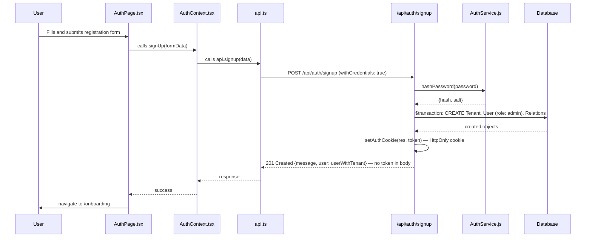
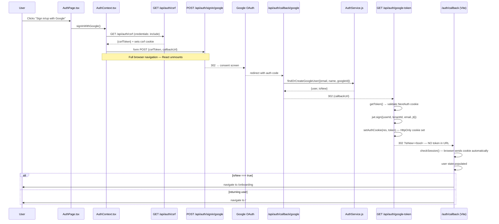

# 1. User Identity & Tenant Management (API)

This document traces the user identity and authentication flow from the API perspective. It covers the endpoints for user registration, sign-in, session handling, and the relationship between Users and Tenants.

---

## 1.1. `pages/api/auth/signup.js` - User & Tenant Creation Endpoint

This is the primary endpoint for new user registration. It's a critical, all-in-one handler that creates the core data structures for a new user.

### Responsibilities:
- **Request Validation**: Performs comprehensive validation on the request body, checking for the presence and format of `email`, `password`, and `tenantName`.
- **Conflict Resolution**: Checks if a user with the provided email already exists to prevent duplicate accounts.
- **Relational Data Validation**: If `countries`, `currencies`, or `bankIds` are provided, it validates that all provided IDs exist in the database.
- **Transactional Creation**: It uses a Prisma `$transaction` to ensure that the creation of a new `Tenant`, the associated `User`, and all relational records (like `TenantCountry`, `TenantCurrency`, `TenantBank`) are created atomically. If any step fails, the entire transaction is rolled back.
- **Password Hashing**: It calls out to an `AuthService` to hash the user's password before storing it in the database.
- **Token Generation**: Generates and signs a new JWT with `user.id`, `user.email`, `tenant.id`, and a `jti: uuidv4()` claim.
- **Cookie Issuance**: Calls `utils/cookieUtils.js → setAuthCookie(res, token)` to write the JWT as an HttpOnly cookie. The token is **not** included in the response body.

### Security & Encryption
- **Password Hashing**: User passwords are not stored directly. They are hashed using the `pbkdf2Sync` algorithm with a unique salt for each user, as handled by the `AuthService`.
- **Email Encryption**: The `User.email` field is encrypted at rest in the database using AES-256-GCM. This is handled transparently by a Prisma middleware. The encryption is **searchable**, meaning the email is encrypted deterministically, allowing for lookups while keeping the raw data secure.

### Data Flow & Logic:
1.  Receives a `POST` request with user and tenant data.
2.  Performs a series of validation checks. Fails with `400 Bad Request` or `409 Conflict` if validation fails.
3.  Initiates a `prisma.$transaction`.
4.  **`Tenant` Creation**: A new `Tenant` record is created with the `tenantName`, a default `plan` of 'FREE', and `plaidHistoryDays` set from the `PLAID_HISTORY_DAYS` environment variable (defaults to `1` if not set). This controls how many days of historical transactions are fetched on initial Plaid sync.
5.  **`User` Creation**: A new `User` is created.
    - The `password` is hashed via `AuthService.hashPassword()`.
    - The `email` is automatically encrypted by the Prisma middleware before being saved.
    - `relationshipType` is hardcoded to 'SELF'.
    - It's linked to the newly created `tenant.id`.
6.  **Relational Linking**: `TenantCountry`, `TenantCurrency`, and `TenantBank` records are created in bulk (`createMany`) to link the new tenant to the validated IDs.
7.  **JWT Generation**: A JWT is signed with `user.id`, `user.email`, `tenant.id`, and `jti: uuidv4()`.
8.  **Role assignment**: `AuthService.createUser()` is called with `role: 'admin'` — signup always creates a tenant owner.
9.  The transaction is committed.
10. `setAuthCookie(res, token)` writes the JWT as an HttpOnly cookie.
11. Returns `201 Created` with `{ message: "Signup successful", user: userWithTenant }` where `userWithTenant` is the user object with the `tenant` nested inside (i.e., `{ ...user, tenant }`). **The `token` field is not in the response body.**

### Dependencies:
- **`../../../services/auth.service`**: The next file to investigate. This service encapsulates the logic for password hashing, which is a critical security function.
- **`prisma`**: Heavy interaction with the Prisma client to perform database operations.

---

## 1.2. `services/auth.service.js` - The Authentication Service

This service class centralizes the core logic for user authentication and management, acting as a dedicated layer between the API route handlers and the database for security-related operations.

### Responsibilities:
- **Password Hashing**: Provides a static `hashPassword` method that takes a plaintext password, generates a cryptographically secure salt, and returns the hashed password and the salt. It uses Node.js's built-in `crypto` library with the `pbkdf2Sync` algorithm.
- **Password Verification**: Provides a corresponding `verifyPassword` method to compare a plaintext password against a stored hash and salt.
- **User Record Management**: Contains methods for finding, creating, and updating user records (`findUserByEmail`, `createUser`, `findOrCreateGoogleUser`). These methods abstract away the direct Prisma calls from the API handlers.
- **OAuth Logic**: Includes logic for handling Google OAuth sign-ins (`findOrCreateGoogleUser`), which involves checking for an existing user, updating their provider information, or creating a new user and tenant if they are signing in for the first time.

### Key Functions:
- **`hashPassword(password)`**:
    - Generates a 16-byte salt.
    - Uses `pbkdf2Sync` with 1000 iterations and a 'sha512' hash function.
    - Returns the `{ hash, salt }`.
- **`verifyPassword(password, hash, salt)`**:
    - Re-hashes the provided password with the stored salt.
    - Compares the result to the stored hash to confirm a match.
- **`findOrCreateGoogleUser({ email, name, googleId })`**:
    - Returns `{ user, isNew }` (not just the user object).
    - `isNew: true` when a brand-new `Tenant` + `User` pair are created (first-time Google sign-in with an unknown email).
    - `isNew: false` when the user already exists (returning Google user) or when an existing email-based account is being linked to Google for the first time (the user record is updated with `provider: 'google'` and `providerId: googleId`).
    - The `isNew` flag is used downstream to route the user to `/onboarding` (new) or `/` (returning) after the OAuth flow completes.

### Role Assignment:
- **`createUser(data, role = 'member')`**: Accepts an optional `role` parameter (default `'member'`). `signup.js` passes `role: 'admin'` since signup always creates a tenant owner. Users created via `POST /api/users` can be assigned any role (`'admin'`, `'member'`, or `'viewer'`), defaulting to `'member'`.
- **`findOrCreateGoogleUser` (updated)**: Now passes `role: 'admin'` when creating a new `User` + `Tenant` pair (first-time Google sign-in). Existing users retain their current role.

### Security Note:
The service correctly implements the standard and secure practice of **salting and hashing** passwords. It never stores passwords in plaintext. The use of a dedicated service for this logic is a good separation of concerns.

---

## 1.3. `pages/api/auth/signin.js` - User Sign-In Endpoint

This endpoint handles the authentication process for existing users.

### Responsibilities:
- **Request Validation**: It validates that the `email` and `password` fields are present in the request body and that the email is in a valid format.
- **User Lookup**: It queries the database to find a user matching the provided email. Because the email is encrypted, this lookup is handled seamlessly by the Prisma middleware, which encrypts the search term before querying the database.
- **Password Verification**: It uses the `AuthService.verifyPassword` method to securely compare the provided password with the stored hash and salt.
- **Token Generation**: Signs a new JWT with `userId`, `tenantId`, `email`, and `jti: uuidv4()`.
- **Cookie Issuance**: Calls `setAuthCookie(res, token)`. The token is **not** in the response body.
- **Security**: To prevent username enumeration, it returns a generic "Invalid credentials" message for both non-existent users and incorrect passwords.

### Data Flow & Logic:
1.  Receives a `POST` request with `email` and `password`.
2.  Performs validation checks. Fails with `400 Bad Request` if data is missing or malformed.
3.  Looks up the `User` in the database by `email`. If no user is found, it fails with a `401 Unauthorized` error.
4.  Calls `AuthService.verifyPassword()` with the incoming password and the user's stored `passwordHash` and `passwordSalt`.
5.  If verification fails, it returns a `401 Unauthorized` error.
6.  Signs a new JWT with a `jti: uuidv4()` claim.
7.  Calls `setAuthCookie(res, token)` to write the JWT as an HttpOnly cookie.
8.  Returns `200 OK` with `{ user }` only — **no `token` field in the response body**.

### Dependencies:
- **`AuthService`**: Relies on the service for the critical password verification step.
- **`prisma`**: Used to find the user in the database.

---

## 1.4. `pages/api/auth/session.js` - Session Validation Endpoint

This `GET` endpoint validates a user's JWT and returns their current session information.

### Responsibilities:
- **Token Extraction**: Uses the `withAuth` wrapper, which accepts the JWT from **either** `req.cookies.token` (HttpOnly cookie) **or** the `Authorization: Bearer <token>` header (fallback). Cookie takes precedence.
- **Token Verification**: `withAuth` uses `jwt.verify` against `JWT_SECRET_CURRENT` (with `JWT_SECRET_PREVIOUS` rotation fallback).
- **Denylist Check**: `withAuth` calls `isRevoked(decoded.jti)` — returns 401 if the token has been server-side revoked (e.g. after sign-out).
- **User Hydration**: Fetches the full user record from the database, selecting `id`, `email`, `name`, `profilePictureUrl`, `provider`, `role`, and the related `tenant` object.
- **Session Response**: Returns the sanitized user object including `provider` and `profilePictureUrl` fields. `email` is auto-decrypted by Prisma middleware.

### Data Flow & Logic:
1.  `withAuth` reads the token from cookie or Bearer header. Returns `401 Unauthorized` if absent or invalid.
2.  `withAuth` verifies the token with `jwt.verify()` and checks the denylist. Returns `401` on failure.
3.  Queries `User` by `userId` (selecting `id`, `email`, `name`, `profilePictureUrl`, `provider`, `role`, `tenant`). Returns `404` if user no longer exists.
4.  Returns `200 OK` with `{ user: { id, email, name, role, tenant, profilePictureUrl, provider } }`.

### Dependencies:
- **`jsonwebtoken`**: For verifying the JWT.
- **`prisma`**: For fetching the user record.
- **`utils/denylist.js`**: For checking whether the token's `jti` has been revoked.

---

## 1.5. Visual Flow: Sign-Up Sequence Diagram

The following diagram illustrates the complete sign-up flow, from the user's interaction with the UI to the creation of records in the database.


---

## 1.5b. `pages/api/auth/signout.js` — Sign-Out Endpoint

A **stateful** sign-out endpoint that actively revokes the caller's JWT server-side.

### Responsibilities:
- Does **not** use `withAuth` — reads the JWT directly from `req.cookies.token` and decodes it with `jwt.decode()` (not `jwt.verify()`).
- If a token is present and decodable, extracts the `jti` and `exp` claims.
- Calls `addToDenylist(jti, remainingTtl)` — immediately invalidates the token in Redis even before natural expiry.
- Calls `clearAuthCookie(res)` from `utils/cookieUtils.js` — sets `Set-Cookie: token=; Max-Age=0` to delete the browser cookie.
- Returns `200 OK` with `{ message: 'Signed out successfully' }`.

### Behaviour:
- Accepts `POST` requests only.
- **Authentication is NOT required** — the endpoint uses `jwt.decode()` (not `jwt.verify()`), so it works even with an expired or invalid token. If no token is present or decoding fails, the endpoint still succeeds by clearing the cookie.
- Token decoding errors are caught silently (non-fatal) — the cookie is always cleared regardless.
- Token revocation is permanent (until natural expiry) — replaying the old token will be rejected by `isRevoked(jti)` in `withAuth`.

### Security Note:
Sign-out is now fully server-driven. The client no longer needs to manage token deletion from `localStorage` — the cookie is HttpOnly and cleared by the server.

---

## 1.5c. Category Seeding at Sign-Up

When a new user/tenant is created via `POST /api/auth/signup`, the signup handler automatically seeds the new tenant with a canonical set of default categories sourced from `lib/defaultCategories.js`.

### How it works:
1. `lib/defaultCategories.js` exports a static array of category objects — each with `name`, `group`, `type`, and optionally `processingHint` and `portfolioItemKeyStrategy`.
2. After the `User` and `Tenant` records are created inside the Prisma `$transaction`, a `prisma.category.createMany()` call inserts all default categories, each tagged with the new `tenantId`.
3. The same list is referenced by the database seed script (`prisma/seed.js`) to populate development/test databases with a consistent category structure.

### Why this matters:
- Ensures every new tenant has a working category set without any manual setup.
- The `processingHint` values on investment/debt categories are required for backend workers to correctly classify and aggregate portfolio items.
- Changes to the default category list in `lib/defaultCategories.js` affect both new tenant signups and re-seeding of the development database.

---

## 1.5d. `pages/api/auth/[...nextauth].js` — NextAuth Catch-All Handler

This file is the NextAuth v4 configuration. It handles the full Google OAuth redirect/callback chain as well as providing the CSRF endpoint required by the frontend to initiate OAuth.

### Architecture — Two-Layer Design:
The NextAuth handler is created **once at module load** via the 1-argument invocation:
```js
const nextAuthHandler = NextAuth({ ...options });
```
The default export is then a **custom `async function handler(req, res)`** that wraps `nextAuthHandler`. This wrapper exists solely to inject CORS headers so that the separate Vite frontend (running on a different port/origin) can call `GET /api/auth/csrf` cross-origin.

### CORS Wrapper Behaviour:
- Sets `Access-Control-Allow-Origin: ${FRONTEND_URL}` (from `process.env.FRONTEND_URL`).
- Sets `Access-Control-Allow-Credentials: true` — **required** so browsers send and receive the `next-auth.csrf-token` cookie cross-origin.
- Allows `GET, POST, OPTIONS` methods.
- Responds to `OPTIONS` preflight requests immediately with `200`.
- Delegates all other requests to `nextAuthHandler(req, res)`.

### Providers:
| Provider | Purpose |
|---|---|
| `GoogleProvider` | OAuth 2.0 sign-in/sign-up via Google. Profile maps `sub → id`, `picture → image`, adds `googleId`. |
| `CredentialsProvider` | Email + password sign-in. Delegates to `AuthService.findUserByEmail` + `AuthService.verifyPassword`. |

### Callbacks:
- **`signIn({ user, account, profile })`**: For the Google provider, calls `AuthService.findOrCreateGoogleUser({ email, name, googleId })` which returns `{ user: googleUser, isNew }`. Mutates NextAuth's transient `user` object in-place: sets `user.id`, `user.tenantId`, `user.isNew`.
- **`jwt({ token, user })`**: On first sign-in (when `user` is present), persists `id`, `tenantId`, `email`, `name`, and `isNew` into the NextAuth JWT cookie. Subsequent requests (where `user` is absent) return the token unchanged.
- **`session({ session, token })`**: Copies `id`, `tenantId`, `email`, and `name` from the JWT token back onto `session.user` (used only if a NextAuth session is ever read directly; the app primarily uses the `google-token` bridge).

### `pages` Config:
Both `signIn` and `error` pages are set to `${FRONTEND_URL}/auth` — pointing to the Vite application, not a Next.js page. This ensures any NextAuth redirect (e.g., OAuth errors) lands on the frontend's auth route.

### `isNew` Flag Propagation:
```
findOrCreateGoogleUser() → { user, isNew }
  └─ signIn callback: user.isNew = isNew
       └─ jwt callback:  token.isNew = user.isNew
            └─ google-token.js: nextAuthToken.isNew → redirect query param &isNew=<bool>
                 └─ /auth/callback (frontend): routes to /onboarding or /
```

### ESM / Module-Interop Note:
Because Next.js compiles ESM modules through webpack, Google and Credentials providers may not export a default function in all evaluation contexts. The file uses a defensive interop pattern:
```js
const GoogleProvider = GoogleProviderImport.default || GoogleProviderImport;
const CredentialsProvider = CredentialsProviderImport.default || CredentialsProviderImport;
```

---

## 1.5e. `pages/api/auth/google-token.js` — Google OAuth → Custom JWT Bridge

This `GET`-only endpoint is the final step in the server-side Google OAuth chain. It is called by NextAuth as the `callbackUrl` after a successful Google consent.

### Purpose:
Converts a short-lived NextAuth session cookie into the application's standard custom JWT, then redirects the browser to the frontend callback page.

### Request:
- **Method**: `GET` only (405 for anything else).
- **Caller**: NextAuth's internal redirect mechanism (not called directly by the frontend).
- **Cookie**: Requires the `next-auth.session-token` cookie to be present (set by NextAuth after the Google callback).

### Behaviour:
1. Calls `getToken({ req, secret: process.env.NEXTAUTH_SECRET })` from `next-auth/jwt` to verify and decode the NextAuth JWT cookie.
2. If the token is missing or has no `id` field → redirect to `${FRONTEND_URL}/auth?error=oauth_failed`.
3. Looks up the user in the database via `prisma.user.findUnique({ where: { id: token.id } })`.
4. If the user is not found → redirect to `${FRONTEND_URL}/auth?error=oauth_failed`.
5. Issues a **custom application JWT** via `jwt.sign({ jti: uuidv4(), userId, tenantId, email }, JWT_SECRET, { expiresIn: '24h' })`. The JWT payload contains only `{ jti, userId, tenantId, email }` — no `role` field.
6. Calls `setAuthCookie(res, token)` to write the JWT as an HttpOnly cookie.
7. Reads `nextAuthToken.isNew ?? false`.
8. Redirects to: `${FRONTEND_URL}/auth/callback?isNew=${isNew}`. **The `token` is NOT in the redirect URL.**

### Error Handling:
- Any uncaught exception is captured by `Sentry.captureException(error)` and the browser is redirected to `${FRONTEND_URL}/auth?error=oauth_failed`.

### Dependencies:
- `next-auth/jwt` (`getToken`) — reads the NextAuth cookie.
- `jsonwebtoken` (`jwt.sign`) — issues the custom application JWT.
- `prisma` — looks up the user record.
- `@sentry/nextjs` — exception reporting.

---

## 1.5f. Google OAuth — Full Sequence Diagram



---

## 1.5g. `pages/api/auth/change-password.js` — Password Update Endpoint

Allows authenticated users to change their password. Only available for credential-based accounts (not OAuth-only).

### Responsibilities:
- **Authentication**: Requires a valid JWT session via `withAuth`.
- **Rate Limiting**: Strict limit of 3 attempts per 15-minute window via `rateLimiters.changePassword`.
- **Current Password Verification**: Verifies the user's current password before allowing a change, using `AuthService.verifyPassword()`.
- **Password Policy Enforcement**: New password must be at least 8 characters.
- **Credential Update**: Hashes the new password via `AuthService.hashPassword()` and updates `passwordHash` + `passwordSalt` in the database.

### Request:
- **Method**: `PUT` only (405 for anything else).
- **Authentication**: Required (`withAuth` wrapper).
- **Body**:
  ```json
  {
    "currentPassword": "string",
    "newPassword": "string",
    "confirmPassword": "string"
  }
  ```

### Validation Flow:
1. Rejects if any of the three fields are missing (`400`).
2. Rejects if `newPassword.length < 8` (`400`).
3. Rejects if `newPassword !== confirmPassword` (`400`).
4. Fetches user's `passwordHash` and `passwordSalt` from the database.
5. Rejects if user has no `passwordHash` — OAuth-only account (`400`).
6. Calls `AuthService.verifyPassword(currentPassword, hash, salt)`. Rejects if false (`401`).
7. Calls `AuthService.hashPassword(newPassword)` to produce new `{ hash, salt }`.
8. Updates the user record with the new hash and salt.
9. Returns `200 OK` with `{ message: "Password updated successfully" }`.

### Response Codes:
| Code | Condition |
|------|-----------|
| `200` | Password updated successfully |
| `400` | Missing fields, password too short, passwords don't match, or OAuth-only account |
| `401` | Current password is incorrect |
| `405` | Wrong HTTP method |
| `429` | Rate limit exceeded |
| `500` | Unexpected server error |

### Session Behaviour:
The endpoint does **not** invalidate the current JWT session. The user remains logged in after changing their password.

### Dependencies:
- **`AuthService`**: `hashPassword()` and `verifyPassword()` for credential operations.
- **`prisma`**: `user.findUnique()` to fetch credentials, `user.update()` to save new hash.
- **`@sentry/nextjs`**: Exception capture on unexpected errors.

---

## 1.6. Tenant & User Management Endpoints

While the `signup` endpoint handles the initial creation, the ongoing management of tenants and users is handled by dedicated RESTful endpoints.

### `pages/api/tenants.js` - Tenant Management
- **`GET /api/tenants`**: Fetches the current user's tenant record, including its related countries, currencies, and banks.
- **`PUT /api/tenants?id={id}`**: This is the key method used by the onboarding and settings pages. It updates the tenant's name, plan, and its associated countries, currencies, and banks. It performs this update within a Prisma transaction to ensure atomicity.
- **Event Emission**: Crucially, after a successful `PUT` request, it compares the list of currencies before and after the update. If they have changed, it dispatches a `TENANT_CURRENCY_SETTINGS_UPDATED` event to the backend service. This is the hook that triggers analytics and portfolio recalculations.
- **`DELETE /api/tenants?id={id}`**: Permanently deletes a tenant and all associated data. The handler verifies tenant ownership (`user.tenantId === id`) and performs a cascading delete within a single Prisma `$transaction`. The deletion sequence removes: join tables (AccountOwner, DebtTerms, PortfolioHolding, PortfolioValueHistory), AI/import models (TransactionEmbedding, StagedImport, ImportAdapter), tags (TransactionTag, Tag), transactions, portfolioItems, accounts, categories, analytics caches (AnalyticsCacheMonthly, AnalyticsCacheDaily, CashFlowCacheDaily, Insights, AuditLogs), tenant relations (TenantCountry, TenantCurrency, TenantBank), PlaidItems, all Users, and finally the Tenant itself. Returns `204 No Content` on success. Errors are logged to Sentry.

### `pages/api/users.js` - User Management
- **`GET /api/users`**: Fetches all users in the tenant (or a single user by ID). Returns the `role` field on each user object.
- **`POST /api/users`** *(Admin only)*: Creates a new user with login credentials. Returns `403 Forbidden` if `req.user.role !== 'admin'`.
  - **Required fields**: `email` (valid format), `password` (min 6 characters).
  - **Optional fields**: `name`, `role` (`'admin'`, `'member'`, or `'viewer'`; defaults to `'member'`), `relationshipType`, `preferredLocale`, `profilePictureUrl`, `birthDate`.
  - Hashes the password via `AuthService.hashPassword()` (PBKDF2-SHA512) before storage.
  - Sets `provider: 'credentials'` so the user can sign in immediately.
  - Returns `409 Conflict` if a user with the same email already exists in the tenant.
- **`PUT /api/users?id={id}`**: Updates user details. Accepts an optional `role` field (`'admin'`, `'member'`, or `'viewer'`). Only admins may set the `role` field; non-admins receive `403`.
- **`DELETE /api/users?id={id}`** *(Admin only)*: Removes a user. Returns `403` if not admin. Prevents self-deletion and deletion of the last user in a tenant.

### Role-Based Access Control

Three user roles with increasing restrictions:

| Role | Permissions |
|------|-------------|
| `admin` | Full access. Can create/edit/delete users, change roles, modify tenant settings. |
| `member` | Standard access. Can perform all financial operations (transactions, imports, portfolio). Cannot manage other users' roles. |
| `viewer` | **Read-only access.** All non-GET requests are blocked at the `withAuth` middleware level with `403 Forbidden: "Viewer accounts are read-only"`. Intended for demo accounts and external stakeholders who need visibility without write access. |

The viewer role enforcement is implemented as a blanket check in `withAuth.js` — it runs before any route-specific logic, ensuring no write operation can bypass it regardless of the endpoint.

### `pages/api/tenants/settings.js` - Tenant Settings *(Admin only)*
- **`GET /api/tenants/settings`**: Returns tenant-level settings including `autoPromoteThreshold`, `reviewThreshold`, and `portfolioCurrency`.
- **`PUT /api/tenants/settings`**: Updates tenant-level settings. Accepts `autoPromoteThreshold` (0.0–1.0), `reviewThreshold` (0.0–1.0), and `portfolioCurrency` (validated against tenant's TenantCurrency list). Returns `403 Forbidden` if `req.user.role !== 'admin'`.

---

## 1.7. `pages/api/onboarding/progress.js` — Onboarding Progress API

Tracks and updates the user's onboarding progress. The progress state is stored as a JSON object on the `Tenant` model.

### `GET /api/onboarding/progress`

Returns the tenant's current onboarding state.

**Response** (`200 OK`):

```json
{
  "onboardingProgress": {
    "checklist": {
      "connectBank": { "done": false, "skipped": false },
      "reviewTransactions": { "done": false },
      "exploreExpenses": { "done": false },
      "checkPnL": { "done": false }
    },
    "setupFlow": {
      "step1_profile": { "completedAt": "2026-03-01T11:00:00.000Z" },
      "step2_connect": { "completedAt": "2026-03-01T11:05:00.000Z" }
    },
    "checklistDismissed": false
  },
  "onboardingCompletedAt": "2026-03-01T12:00:00.000Z"
}
```

### `PUT /api/onboarding/progress`

Updates a specific onboarding step.

**Request Body:**

```json
{
  "step": "connectBank",
  "data": {}
}
```

**Valid Steps:**

| Category | Steps |
|----------|-------|
| Checklist items | `connectBank`, `reviewTransactions`, `exploreExpenses`, `checkPnL` |
| Setup flow | `step1_profile`, `step2_connect` |
| Special | `setupComplete` (sets `onboardingCompletedAt`), `dismissChecklist` |
| Deprecated | `setPortfolioCurrency` — accepted silently but ignored (returns current progress unchanged) |

**Behaviour:**
- Checklist items are stored as objects with `{ done: boolean, skipped?: boolean }`, not simple booleans. Marking a step sets `done: true` and merges any additional fields from `data`.
- Setup flow steps are stored as objects with `{ completedAt: "<ISO timestamp>", ...data }`.
- `setupComplete` additionally sets `Tenant.onboardingCompletedAt` to the current timestamp.
- `dismissChecklist` sets `checklistDismissed: true` — hides the checklist from the dashboard.
- `setPortfolioCurrency` is deprecated — the endpoint accepts it silently for backward compatibility but returns the current progress without any changes.
- The `data` field is optional and merged into the step object (e.g., passing preferences during setup steps).
- **Server-side auto-correction on GET**: The GET endpoint auto-corrects data-backed checklist items — if accounts exist, `connectBank.done` is set to `true`; if transactions exist, `reviewTransactions.done` is set to `true`. The deprecated `setPortfolioCurrency` key is stripped from the response.

**Response** (`200 OK`): The updated `onboardingProgress` object.

### Data Model Additions

```prisma
model Tenant {
  // ... existing fields ...
  onboardingProgress   Json?
  onboardingCompletedAt DateTime?
}
```

### Auth & Security
- **Authentication**: JWT via `withAuth`.
- **Tenant scoping**: All operations use `req.user.tenantId`.
- **Rate limiting + CORS**: Standard middleware applied.
