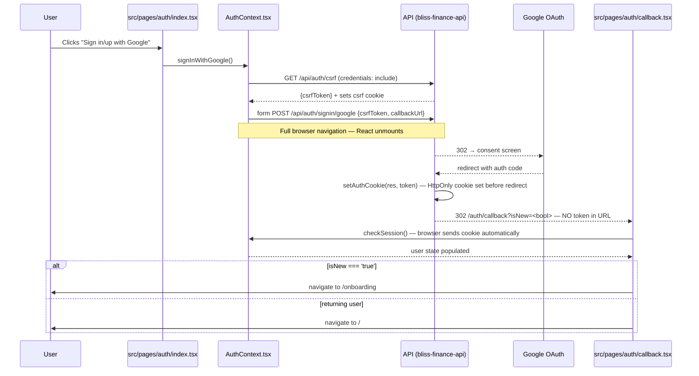
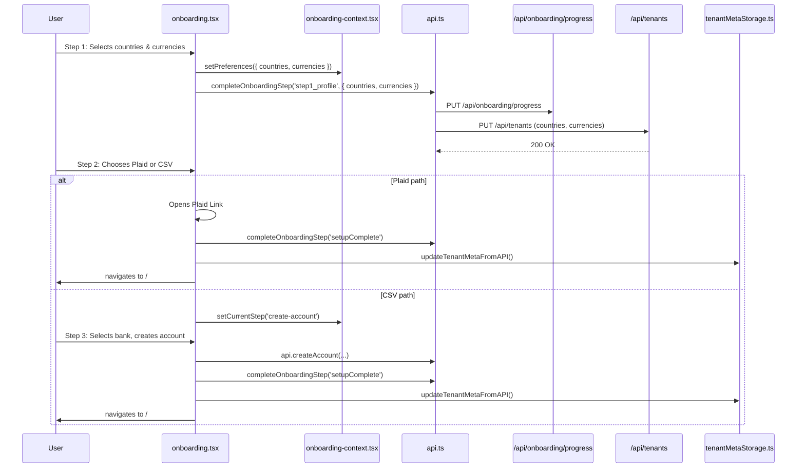

# 1. User Identity & Tenant Management (Frontend)

This document traces the complete user and tenant lifecycle from the frontend perspective. It covers user registration, the initial onboarding flow, session management, and ongoing tenant and user settings management.

---

## 1.1. `src/pages/auth/index.tsx` - The Authentication Hub

This component serves as the primary user interface for both logging in and registering a new account. It features a modern two-panel layout inspired by the Bliss UIKit design system.

### Layout:

**Desktop (≥900px)** — 50/50 horizontal split:

| Left Panel | Right Panel |
|-----------|-------------|
| **Bliss logo** (top-left, `Logo` component `size="md"`) | **"Welcome back"** greeting text (centered, muted) |
| **Headline**: "The quiet intelligence behind your global wealth." | **Auth Card** (glassmorphic `Card` component): |
| **Subheading**: "Financial clarity, without borders." | — Custom pill tabs (Sign In / Sign Up) with dark active state |
| **Mascot illustration** (`/images/auth-mascot.png`, `mix-blend-mode: multiply`, bleeds to bottom) | — Google OAuth button (multicolor SVG icon) |
| Ambient radial gradients + 1px gradient right-edge border | — "or continue with email" separator |
| | — Sign In or Sign Up form (see below) |
| | — Tab switch prompt ("Don't have an account? Create one") |
| | **Footer**: "Protected by enterprise-grade encryption. Privacy Policy" |

**Mobile (<900px)** — Stacked vertical column: Logo → Headline → Subheading → Illustration → Auth Card → Footer. Uses a `useIsDesktop()` hook with `window.matchMedia("(min-width: 900px)")`.

### Responsibilities:
- Renders two distinct forms: one for **Sign In** and one for **Sign Up**.
- Uses custom pill-style tabs (`AuthTabs` component) to switch between the two forms. Active tab: dark background (`--brand-deep`), white text. Inactive: transparent, muted text.
- Employs `zod` for robust schema-based validation on all input fields.
- Handles the form submission process, displaying loading states and error messages.
- Interacts with the `AuthContext` to perform the actual sign-in and sign-up logic.
- On successful authentication, it navigates the user to the appropriate next page (`/onboarding` for new users, `/` for existing users).

### Validation Schemas:

| Schema | Fields | Rules |
|--------|--------|-------|
| `loginSchema` | `email`, `password` | email: valid format; password: min 6 chars |
| `registerSchema` | `name`, `email`, `password` | name: min 2 chars; email: valid format; password: min 8 chars |

Note: The register form does **not** include a confirm-password field. Instead, a hint is displayed: "Use at least 8 characters, including a number."

### Sign In Form:
- **Email address** input (`autoComplete="email"`)
- **Password** input with a **"Forgot password?"** link button (right-aligned, hover transitions `--brand-primary` → `--brand-deep`)
- **"Sign In"** primary button (full width, loading spinner when pending)
- Error messages displayed inline

### Sign Up Form:
- **Full name** input (`autoComplete="name"`)
- **Email address** input (`autoComplete="email"`)
- **Password** input with hint text (`autoComplete="new-password"`)
- **Terms & Privacy text**: "By creating an account you agree to our **Terms of Service** and **Privacy Policy**." — both are underlined clickable spans styled with `--brand-primary`.
- **"Create Account"** primary button (full width, loading spinner when pending)
- Error messages displayed inline

### Key Functions:
- **`onLoginSubmit(values)`** (inside `SignInForm`):
    - Calls the `signIn` function from `useAuth()`.
    - On success, navigates the user to the main dashboard (`/`).
- **`onRegisterSubmit(values)`** (inside `SignUpForm`):
    - Calls the `signUp` function from `useAuth()`.
    - **Important**: The initial `signUp` call sends an empty payload for `countries`, `currencies`, and `bankIds`. This indicates that the core tenant setup happens later in the onboarding process.
    - On success, saves tenant meta to localStorage via `setTenantMeta()` and navigates to `/onboarding`.
- **Google OAuth button** (`GoogleButton` component):
    - Both the **Sign In** tab and the **Sign Up** tab render a styled Google button (multicolor SVG icon, white background, border, hover shadow) positioned above an "or continue with email" divider (`OrSeparator`).
    - Sign In tab label: **"Sign in with Google"**. Sign Up tab label: **"Sign up with Google"**.
    - Both call `signInWithGoogle()` from `useAuth()`.
    - The same OAuth flow handles both new and returning users — the distinction is made server-side by `AuthService.findOrCreateGoogleUser`. New users are routed to `/onboarding`; returning users are routed to `/`.

### Styling Approach:
- All colors use design tokens (CSS variables from `src/index.css`) — no raw Tailwind colors per `CLAUDE.md` rules.
- Ambient radial gradients on both panels (inline styles, pointer-events: none overlays).
- Card glassmorphism applied globally via `[data-slot="card"]` in `index.css` (backdrop-filter blur, layered shadows, inset highlight).
- Tailwind for layout/spacing; inline styles for gradients and effects that can't be expressed in Tailwind.

---

## 1.2. `src/pages/onboarding.tsx` - The Onboarding Flow

A 3-step wizard with Framer Motion transitions and TypeAnimation text reveal that guides new users through initial setup.

### Steps

1. **Welcome** (`currentStep: 'welcome'`)
   - TypeAnimation typewriter text reveal for the welcome message.
   - Multi-select **country picker** with emoji flags — users choose which countries they have financial accounts in.
   - Multi-select **currency picker** with currency symbols — users choose their active currencies.
   - "Continue" button advances to step 2 and calls `completeOnboardingStep('step1_profile')`.

2. **Connect** (`currentStep: 'connect'`)
   - Two paths presented:
     - **Plaid Link** (primary CTA) — Opens the Plaid connection flow. On success, redirects to the dashboard.
     - **CSV Import** (secondary) — Navigates to the bank selection step for manual account creation.
   - Calls `completeOnboardingStep('step2_connect')` on progression.

3. **Create Account** (`currentStep: 'create-account'`)
   - **Bank selection grid** — Filtered by the countries selected in step 1. Users select their bank.
   - **Inline `AccountForm`** — After selecting a bank, an inline form allows the user to create their first account.
   - On account creation, calls `completeOnboardingStep('setupComplete')` which sets `Tenant.onboardingCompletedAt`.
   - Navigates to the main dashboard.

### Context: `src/contexts/onboarding-context.tsx`

Manages wizard state across steps:

| State | Type | Description |
|-------|------|-------------|
| `currentStep` | `'welcome' \| 'connect' \| 'create-account'` | Current wizard step |
| `preferences` | `{ countries: string[], currencies: string[] }` | User's selections from step 1 |

### Hooks

| Hook | File | Description |
|------|------|-------------|
| `useOnboardingProgress()` | `use-onboarding-progress.ts` | `GET /api/onboarding/progress`. 5-min stale time. |
| `useCompleteOnboardingStep()` | `use-onboarding-progress.ts` | Mutation: `PUT /api/onboarding/progress` with `{ step, data? }`. Invalidates cache. |
| `useMetadata()` | `use-metadata.ts` | Countries, currencies, banks reference data. |
| `useBanks()` | `use-banks.ts` | Filtered bank list for the bank selection grid. |

### Onboarding Checklist

After setup completes, a post-onboarding checklist is tracked via the `onboardingProgress` JSON on the Tenant model. The checklist encourages users to explore key features:

| Item | Key | Completed When |
|------|-----|---------------|
| Connect a bank | `connectBank` | User connects via Plaid |
| Review transactions | `reviewTransactions` | User visits the review page |
| Set portfolio currency | `setPortfolioCurrency` | User updates currency in settings |
| Explore expenses | `exploreExpenses` | User visits the analytics page |
| Check P&L | `checkPnL` | User visits the portfolio page |

The checklist is dismissible via `dismissChecklist` step. Future enhancement: auto-complete items on relevant page visits.

---

## 1.3. `src/pages/settings/index.tsx` & `users.tsx` - Settings & User Management

These components allow a user to manage their tenant's configuration and the users associated with it on an ongoing basis.

### Page Layout

The settings page uses a constrained layout (`max-w-[880px]`, centered) with a page header and pill-style tab navigation.

**Page Header:**
- Icon tile (42px rounded-xl, `bg-brand-primary/10`) with `Settings` Lucide icon
- Title: "Settings" + subtitle: "Manage your workspace, preferences, and users."

**Tab Navigation — Pill Segmented Control:**
- Inline-flex pill tabs (`bg-muted border border-border rounded-[0.875rem] p-[3px]`)
- Active state: `bg-primary text-primary-foreground rounded-[0.75rem]` with shadow
- 5 tabs: General, Countries & Currencies, Banks, Plan, AI Classification
- Each tab has a Lucide icon prefix (SettingsIcon, Globe, Building, CreditCard, Sparkles)
- Horizontally scrollable on small screens (`overflow-x-auto`)

### Card Architecture

All settings cards follow a structured 3-zone pattern inspired by the Bliss UIKit:

| Zone | Layout | Description |
|------|--------|-------------|
| **Header** | `px-7 pt-[22px] pb-[18px]` | Title (`text-lg font-medium`) + description (`text-[0.8125rem] text-muted-foreground`) |
| **Body** | `px-7 py-7` | Form fields, grouped by `SectionLabel` micro-labels |
| **Footer** | `px-7 py-4 flex items-center justify-between` | `SaveConfirmation` (left) + Save button (right, `ml-auto`) |

Zones are separated by `CardDivider` components (`h-px w-full bg-border`). Cards use `className="overflow-hidden p-0 gap-0"` to override the base Card's default `gap-6` and `padding`.

### Reusable Design System Components

Five new components were created for the settings page and shared across the app:

| Component | File | Purpose |
|-----------|------|---------|
| `SectionLabel` | `src/components/ui/section-label.tsx` | Uppercase micro-label (11px, 600 weight, 0.08em tracking, `text-muted-foreground`) for grouping form fields |
| `CardDivider` | `src/components/ui/card-divider.tsx` | Full-width horizontal rule with optional `variant="destructive"` (`bg-destructive/25`) |
| `SettingsSelect` | `src/components/settings/settings-select.tsx` | Labeled `Select` wrapper with hint text, `h-11`, `bg-input-background`, `rounded-xl` |
| `MultiSelectCombobox` | `src/components/settings/multi-select-combobox.tsx` | Searchable multi-select built on `Popover` + `Command` (cmdk). Trigger button with count, searchable dropdown with checkboxes, removable `Badge` pills below. Props: `renderPillExtra` for custom pill content (e.g. Plaid link icon) |
| `SaveConfirmation` | `src/components/settings/save-confirmation.tsx` | Inline "Changes saved" feedback — green SVG checkmark + text, opacity fade-in (250ms ease), auto-dismiss after 2.5s |

### Save Pattern

Each card has its own `useSaveConfirmation()` hook instance (5 total: `generalSave`, `countriesSave`, `portfolioSave`, `banksSave`, `aiSave`). On successful API response, `trigger()` is called to show the inline `SaveConfirmation`. Toast notifications are reserved for errors only.

Two separate APIs are used:
- `api.updateTenant(tenantId, data)` — workspace name, countries, currencies, banks
- `updateTenantSettings.mutate(data)` — portfolio currency, AI classification thresholds

### Tab: General

**Workspace Details Card:**
- `SectionLabel`: "Identity"
- Workspace Name input (`bg-input-background`)
- Current Plan badge (read-only, color-coded: Free=positive, Pro=brand-deep, AI=brand-primary)
- User Management link to `/settings/users` (outline button with `Users` + `ExternalLink` icons)
- Footer: Save button + `SaveConfirmation`

**Danger Zone Card** (within the General tab):
- `border-destructive/30` with custom reddish box-shadow
- `AlertTriangle` icon + "Danger Zone" title in `text-destructive`
- `CardDivider variant="destructive"`
- Left side: "Delete Workspace" heading + description (`max-w-[420px]`)
- Right side: type-to-confirm input ("delete my account", case-insensitive) + outline destructive button (`border-destructive text-destructive bg-transparent hover:bg-destructive/10`)
- `AlertDialog` confirmation flow before calling `api.deleteTenant(tenantId)`
- On deletion: success toast, `signOut()`, navigate to `/auth`

### Tab: Countries & Currencies

**Countries & Currencies Card:**
- Two `MultiSelectCombobox` instances stacked with `SectionLabel` headings
- **Countries**: options from `useMetadata().countries` with emoji flag icons, searchable by name
- **Currencies**: options from `useMetadata().currencies` with symbol icons, display format "USD — US Dollar", searchable by name or code
- Footer: Save button (calls `api.updateTenant`) + `SaveConfirmation`

**Portfolio Display Currency Card:**
- `SettingsSelect` dropdown filtered to only currencies the tenant has selected
- Hint text explaining automatic exchange rate conversion
- Separate save button (calls `updateTenantSettings.mutate({ portfolioCurrency })`)
- Save button disabled when value matches current `tenantSettings.portfolioCurrency`

### Tab: Banks

**Banks Card:**
- `MultiSelectCombobox` for bank selection from `useMetadata().banks`
- Plaid-connected banks show a `LinkIcon` badge in their pill chip (via `renderPillExtra`)
- **Connected Accounts Summary** (conditional, shown when Plaid banks exist): Plaid-connected count + manual count + "Manage accounts" link to `/accounts`
- **Add New Bank** section (`SectionLabel`): inline input + "Add" button, calls `api.createBank({ name })`, auto-selects the new bank, validation 2-100 chars
- Footer: Save button + `SaveConfirmation`

### Tab: Plan

- Structured card wrapping a 3-column responsive grid (`grid-cols-1 md:grid-cols-3`)
- Plan comparison cards for FREE, PRO, AI with price, features list, and action button
- Active plan shows `border-primary ring-1 ring-primary/20` + disabled "Current Plan" button
- Footer: Save button

### Tab: AI Classification

- `Sparkles` icon in card header alongside title
- `SectionLabel`: "Thresholds"
- **Auto-Promote Threshold**: `Slider` (50-100%) with large percentage display. Transactions at or above this confidence are promoted automatically.
- **Review Threshold**: `Slider` (0-100%). Minimum quality bar for AI classification.
- Validation warning (`bg-warning/10 text-warning`) when review >= auto-promote
- `SectionLabel`: "Classification Pipeline" — read-only explanation of the 4-tier waterfall (Exact Match, Vector Match, Global Vector, LLM)
- Footer: Save button (calls `updateTenantSettings.mutate`) + `SaveConfirmation`. Disabled when thresholds are invalid.

### Data Flow

1. **Initialization**: State loaded from `localStorage` via `getTenantMeta()` for instant render, then refreshed from API via `updateTenantMetaFromAPI(user.tenant.id)`.
2. **Editing**: Local state updated via `handleSettingsChange(field, value)`.
3. **Saving**: `handleSaveChanges()` calls `api.updateTenant(tenantId, settings)`, updates `localStorage` via `setTenantMeta(pickTenantMetaFields(response))`, and triggers the inline save confirmation.
4. **AI/Portfolio settings**: Separate mutation via `useUpdateTenantSettings()` hook (React Query).

### Responsibilities (`users.tsx` - User Management):
-   **User Lifecycle Management**: Provides a full suite of CRUD (Create, Read, Update, Delete) operations for users within a tenant.
-   **Role Display**: The user table includes a **Role** column showing each user's role as a colour-coded badge (purple for `admin`/`owner`, muted for `viewer`/`readonly`, default muted for `member`).
-   **Create User**: Opens a dialog with fields for **Name**, **Email**, **Password** (min 6 characters), **Role** (Admin / Member / Viewer), and **Preferred Language**. Calls `api.createUser` to create the user with login credentials. The "Create User" button is disabled until a valid email and password (6+ characters) are provided. The user can sign in immediately after creation.
-   **Edit User**: Calls `api.updateUser` to modify a user's details. The edit dialog includes a **Role** `<Select>` field (`Admin` / `Member` / `Viewer`). The `role` value is included in the `handleUpdateUser` payload. Only admins may change another user's role.
-   **Remove User**: Calls `api.deleteUser` to remove a user's access to the tenant.

### Role Options:

| Role | Icon | Label | Description |
|------|------|-------|-------------|
| `admin` | `Shield` | Admin | Full access to all features and settings |
| `member` | — | Member | Standard access to financial operations |
| `viewer` | `Eye` | Viewer (read-only) | Browse-only access; all write operations blocked server-side |

---

## 1.4. `src/contexts/AuthContext.tsx` - The Auth Logic Controller

This context is the heart of the frontend's authentication system. It provides the `useAuth` hook, which abstracts away API interaction and state management for the rest of the application.

### Responsibilities:
- **State Management**: Maintains the global authentication state including the `user` object.
- **Session Checking**: On load, `checkSession` calls `api.getSession()`. The API reads the HttpOnly `token` cookie server-side. The frontend does **not** read or store the JWT — session state is entirely cookie-driven.
- **API Abstraction**: Wraps `api.signup` and `api.signin`. Neither returns a `token` field; the session cookie is set server-side before the response is sent.
- **No localStorage token management**: There are no `localStorage.getItem/setItem/removeItem` calls for the JWT. The token lives exclusively in the HttpOnly cookie managed by the browser. `signIn`, `signUp`, and `signOut` do not touch `localStorage`.
- **Google OAuth initiation (`signInWithGoogle`)**:
    1. Fetches a CSRF token from `GET ${NEXT_PUBLIC_API_URL}/api/auth/csrf` with `credentials: 'include'`.
    2. Creates an HTML `<form>` targeting `POST /api/auth/signin/google`.
    3. Appends hidden `csrfToken` and `callbackUrl` inputs.
    4. Calls `form.submit()` — full browser navigation, NextAuth handles the OAuth redirect.
- **`checkSession` in public interface**: Exposed so `callback.tsx` can trigger a session refresh after the Google OAuth landing (the cookie was already set server-side).

---

## 1.4b. `src/pages/auth/callback.tsx` — OAuth Landing Page

Silent transient page. The browser is redirected here by `google-token.js` at the end of the Google OAuth chain. It is never navigated to directly.

### Route:
`/auth/callback` — registered as a public (non-protected) route in `src/routes.tsx`.

### Behaviour on Mount:
1. Reads only **`?isNew`** from `URLSearchParams`. The `?token=` parameter no longer exists — the JWT was delivered as an HttpOnly cookie before the redirect.
2. Calls `checkSession()` from `useAuth()`. The browser automatically sends the cookie.
3. If `isNew === 'true'` → navigate to `/onboarding` (replace). Otherwise → navigate to `/` (replace).
4. If `checkSession()` throws → navigate to `/auth?error=oauth_failed`.

### What was removed vs. the previous version:
- No `?token=` read from URL.
- No `localStorage.setItem('token', token)`.
- No `window.history.replaceState` to scrub a token from the URL (URL never contained one).

### Rendered UI:
A centred `<Loader2 className="animate-spin" />` spinner while processing.

### Dependencies:
- `useAuth()` — for `checkSession`.
- `useNavigate()` from `react-router-dom`.
- `lucide-react` (`Loader2`).

---

## 1.4c. Google OAuth — Frontend Sequence Diagram

---

## 1.5. `src/lib/api.ts` - The API Client

Reusable `APIClient` class (backed by `axios`) — the single point of contact for all communication between the frontend and the API.

### Responsibilities:
- **Centralized API Methods**: All endpoint methods (`getUsers`, `createUser`, `updateUser`, `deleteUser`, `updateTenant`, etc.).
- **Credential-based Requests**: Axios is configured with `withCredentials: true`. The browser automatically includes the HttpOnly `token` cookie on every request — no manual JWT handling.
- **No Authorization Header Injection**: The previous interceptor that read the JWT from `localStorage` and appended `Authorization: Bearer <token>` has been removed. Token delivery is entirely browser-native via the cookie mechanism.
- **Global Error Handling**: A response interceptor checks for `401 Unauthorized` and redirects to the login page.
- **Updated return types**: `signup` and `signin` no longer include `token` in their TypeScript return type — the response is `{ user }` only.

---

## 1.6. Visual Flow: Onboarding Sequence Diagram

